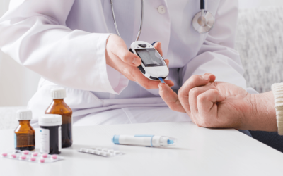
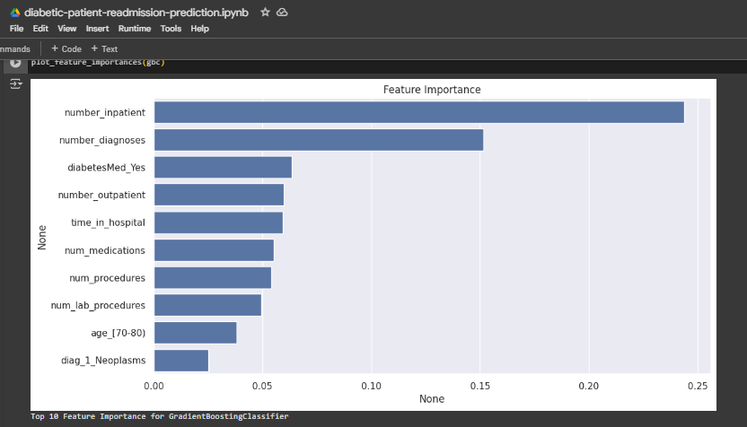

# Diabetes Readmission Prediction

## Table of Contents
- [Project Overview](#project-overview)
- [Project Objective](#project-objective)
- [Data Sources](#data-sources)
- [Data Preprocessing](#data-preprocessing)
- [Machine Learning Model](#machine-learning-model)
- [Evaluation Metrics](#evaluation-metrics)
- [Final Model Choice](#final-model-choice)
- [Integration](#integration)
- [Conclusion](#conclusion)

## Project Overview
At Amdari, I led the development of a predictive analytics solution focused on identifying diabetic patients at high risk of hospital readmission within 30 days. Hospital readmissions are not only expensive but often indicative of gaps in post-discharge care.
Using a large EHR dataset containing over 100,000 patient records, I applied machine learning techniques to uncover key drivers of readmission and built interpretable models to assist healthcare professionals in prioritizing follow-up care.

## Project Objective
The objective of this project is to develop an end-to-end machine learning pipeline that predicts 30-day hospital readmission among diabetic patients. The aim is to support hospitals in:
- Improving clinical outcomes
- Reducing preventable readmissions
- Allocating care management resources efficiently

## 📂 Data Sources  
- 📚 Dataset: [UCI Diabetes 130-US Hospitals (1999–2008)](https://archive.ics.uci.edu/ml/datasets/diabetes+130-us+hospitals+for+years+1999-2008)  
- Records include:
  - Demographics (Age, Race, Gender)  
  - Visit history (Inpatient, Outpatient, ER)  
  - Lab tests, medications, diagnoses  
  - Readmission label (within 30 days / >30 days / No readmission)

## Data Preprocessing
✔️ Dropped duplicates and non-informative columns  
✔️ Mapped ICD-9 codes into broader diagnosis groups  
✔️ Encoded categorical features (e.g., insulin use, medication status)  
✔️ Balanced target classes using stratified sampling  
✔️ Engineered predictive features such as:
- `number_inpatient`, `number_diagnoses`, `time_in_hospital`, `diabetesMed`

## Machine Learning Model 
The following models were trained and evaluated:
- Logistic Regression
- Random Forest Classifier
- XGBoost Classifier
- Nearest Centroid Classifier

## Final Model Choice
The Random Forest Classifier yielded the best performance, with an accuracy of approximately 88% and strong recall on the minority class (readmitted).

🔍 Top 10 Predictive Features (Feature Importance):

## Conclusion
This project demonstrates how machine learning can be applied to real-world clinical data to generate actionable insights and improve patient care pathways. Key takeaways include:
- Patient history (e.g., previous admissions, chronicity) plays a significant role in readmission risk
- Readmitted patients tend to have longer hospital stays and more complex conditions
- Data science can augment clinical decision-making — not replace it — by offering timely, interpretable predictions

📌 The full notebook and codebase are available in this repository. Contributions and feedback are welcome!
